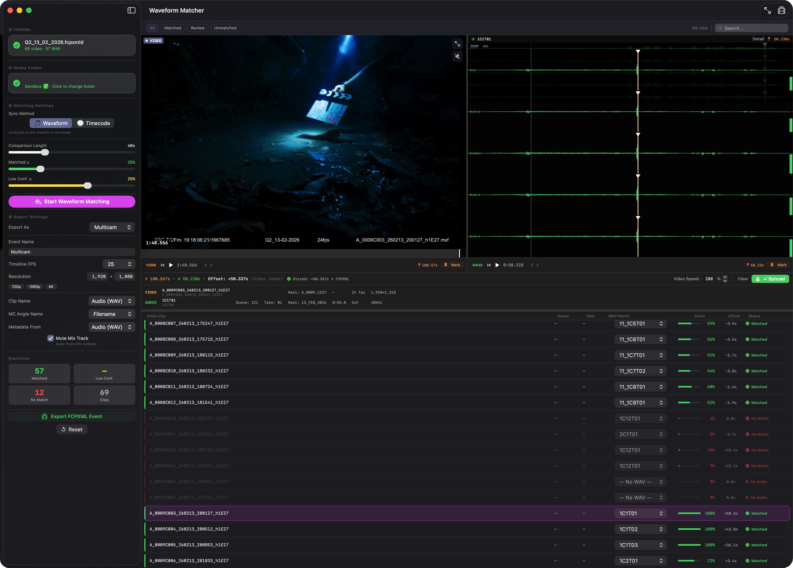

# คู่มือการใช้งาน WaveformMatcher

---

## สารบัญ
1. [WaveformMatcher คืออะไร](#1-waveformmatcher-คืออะไร)
2. [ทำไมต้อง WaveformMatcher](#2-ทำไมต้องใช้-waveformmatcher)
3. [ความต้องการของระบบ](#3-ความต้องการของระบบ)
4. [การติดตั้ง](#4-การติดตั้ง)
5. [ภาพรวมหน้าจอ](#5-ภาพรวมหน้าจอ)
6. [Workflow มาตรฐาน](#6-workflow-มาตรฐาน)
7. [ฟีเจอร์เสริม](#7-ฟีเจอร์เสริม)
8. [Keyboard Shortcuts](#8-keyboard-shortcuts)
9. [ลิงก์และทรัพยากร](#9-ลิงก์และทรัพยากร)

---

## 1. WaveformMatcher คืออะไร

**WaveformMatcher** คือแอปพลิเคชันสำหรับ macOS ที่ออกแบบมาเพื่อแก้ปัญหาการซิงค์เสียงระหว่างคลิปวิดีโอที่ถ่ายจากกล้องกับไฟล์เสียงคุณภาพสูง (WAV) ที่บันทึกแยกจากเครื่องบันทึกเสียงมืออาชีพ

### การทำงานพื้นฐาน
- วิเคราะห์คลื่นเสียง (Audio Waveform) จากวิดีโอและไฟล์ WAV
- หาจุดที่ตรงกันอัตโนมัติด้วยเทคโนโลยี Audio Fingerprinting
- ใช้ Timecode สำหรับการจับคู่เมื่อมีข้อมูล Timecode ที่ถูกต้อง
- ส่งออกไฟล์ FCPXML ที่พร้อมนำเข้า Final Cut Pro ทันที

---

## 2. ทำไมต้องใช้ WaveformMatcher

### ปัญหาในงานตัดต่อวิดีโอ

ในการถ่ายทำภาพยนตร์หรือวิดีโอมืออาชีพ:
- **กล้อง** จะบันทึกเสียงสำรอง (Scratch Audio) ที่มีคุณภาพต่ำเพื่อใช้อ้างอิง
- **ฝ่ายเสียง** จะบันทึกเสียงจริงด้วยอุปกรณ์คุณภาพสูง (เช่น Sound Devices, Zoom) ออกมาเป็นไฟล์ WAV

**ปัญหา:** เมื่อมีคลิปวิดีโอหลายสิบหรือหลายร้อยคลิป คุณต้อง:
1. จับคู่คลิปวิดีโอแต่ละคลิปกับไฟล์ WAV ที่ตรงกัน
2. ซิงค์ให้ตรงเวลาอย่างแม่นยำ
3. ทำซ้ำๆ ด้วยมือใน Final Cut Pro ซึ่งใช้เวลานานมาก

### วิธีแก้ของ WaveformMatcher

✅ **อัตโนมัติ 100%** - วิเคราะห์และจับคู่อัตโนมัติ  
✅ **แม่นยำ** - ใช้ Audio Fingerprinting และ Timecode  
✅ **ประหยัดเวลา** - จากหลายชั่วโมงเหลือไม่กี่นาที  
✅ **พร้อมใช้งาน** - ส่งออก FCPXML ที่ import เข้า Final Cut Pro ได้ทันที

---

## 3. ความต้องการของระบบ

### ระบบปฏิบัติการ
- **macOS 14.0+** (Sonoma หรือใหม่กว่า)

### ซอฟต์แวร์ที่จำเป็น
- **Final Cut Pro** (สำหรับ import ผลลัพธ์)

### ไฟล์ที่ต้องมี
- **FCPXML** จาก Final Cut Pro (ไฟล์ `.fcpxml` หรือ package `.fcpxmld`)
- **ไฟล์ WAV** จากฝ่าย Sound (เสียงคุณภาพสูงจากกองถ่าย)

---

## 4. การติดตั้ง

### ⚠️ สำคัญ: แอปยังไม่ผ่านการ Notarize จาก Apple

เนื่องจาก WaveformMatcher เป็นแอปที่พัฒนาโดยอิสระและยังไม่ได้ส่งให้ Apple ตรวจสอบ (Notarize) macOS Gatekeeper จะบล็อกการเปิดแอปครั้งแรก

#### วิธีแก้ทางเลือกที่ 1 — คลิกขวาเปิด (แนะนำ)

1. ใน Finder ให้ **คลิกขวา** ที่ `WaveformMatcher.app`
2. เลือก **Open** จากเมนู
3. ในกล่องข้อความที่ขึ้นมา กด **Open** อีกครั้ง
4. ถ้ายังติดบล็อก:
   - ไปที่ **System Settings → Privacy & Security**
   - กด **Open Anyway**

#### วิธีแก้ทางเลือกที่ 2 — ใช้ Terminal

1. เปิด **Terminal**
2. พิมพ์คำสั่ง (แก้ไข path ให้ตรงกับที่วางแอป):
   ```bash
   xattr -dr com.apple.quarantine /Applications/WaveformMatcher.app
   ```
3. เปิดแอปได้ตามปกติ

---

## 5. ภาพรวมหน้าจอ

เมื่อเปิดแอปครั้งแรก คุณจะเห็นหน้าจอหลักที่แบ่งเป็น 3 ส่วน:



### ส่วนประกอบหลัก

#### แผงซ้าย (Sidebar)
- **FCPXML**: แสดงไฟล์ที่โหลดอยู่
- **Media Folder**: โฟลเดอร์ที่เก็บไฟล์ WAV
- **Matching Settings**: ตั้งค่าโหมดการซิงค์
- **Export Settings**: ตั้งค่าการส่งออก

#### พื้นที่หลัก (Main Area)
- **ตารางคลิป**: แสดงชื่อไฟล์วิดีโอต้นฉบับและเรียง Filename, Scene, Speed หรือ Status ได้ทั้งสองทิศทาง
- **Waveform Viewer**: แสดงคลื่นเสียงของ WAV แบบหลายช่อง
- **Video Player**: เล่นวิดีโอพร้อม Seek Bar

---

## 6. Workflow มาตรฐาน

### ขั้นตอนที่ 1 — Export FCPXML จาก Final Cut Pro

ก่อนใช้ WaveformMatcher คุณต้อง export ข้อมูลออกจาก Final Cut Pro ก่อน

#### แบบ Event (แนะนำ)
1. เปิด Final Cut Pro
2. ไปที่ Library → คลิกขวาที่ **Event** ที่ต้องการ
3. เลือก **Export FCPXML**
4. บันทึกเป็นไฟล์ `.fcpxml` หรือ `.fcpxmld`

#### แบบ Timeline (Project)
1. เปิด Timeline/Project ที่ต้องการ
2. เมนู **File → Export XML**
3. เลือก format เป็น **FCPXML**
4. บันทึกไฟล์

### ขั้นตอนที่ 2 — Import FCPXML เข้า WaveformMatcher

มี 4 วิธี:

#### วิธี A — ลากไฟล์วาง (Drag & Drop)
- ลากไฟล์ `.fcpxml` หรือ `.fcpxmld` มาวางที่ปุ่ม **Import** ในแอป

#### วิธี B — เมนู File
- ไปที่ **File → Import FCPXML…** 
- หรือกด `Cmd+I`

#### วิธี C — Workflow Extension (ถ้าติดตั้ง)
1. ใน Final Cut Pro เปิด **Workflow Extension** ของ WaveformMatcher
2. ลาก **Event** หรือ **Timeline** จาก Final Cut Pro เข้า panel
3. แอปหลักจะเปิดขึ้นมาพร้อมข้อมูลอัตโนมัติ

#### วิธี D — เปิดไฟล์ .wmproj
- ดับเบิลคลิกที่ไฟล์ `.wmproj` ใน Finder (สำหรับงานที่เคยบันทึกไว้)

### ขั้นตอนที่ 3 — ตั้งค่า Media Folder

แอปต้องรู้ว่าไฟล์ WAV อยู่ที่ไหน:

1. ดูที่แผงซ้าย ส่วน **Media Folder**
2. กด **Click to change folder**
3. เลือกโฟลเดอร์ที่เก็บไฟล์ WAV ทั้งหมด
4. แอปจะสแกนหาไฟล์ WAV ในโฟลเดอร์นั้นและโฟลเดอร์ย่อยอัตโนมัติ

### ขั้นตอนที่ 4 — เลือกโหมดการ Sync

แอปมี 3 โหมดในส่วน **Matching Settings**:

#### 🟢 Waveform (แนะนำให้ลองก่อน)

**การทำงาน:** วิเคราะห์คลื่นเสียง (Audio Waveform) ของทั้งวิดีโอและ WAV แล้วหาจุดที่ตรงกันอัตโนมัติ

**เหมาะสำหรับ:**
- คลิปที่มีเสียงบันทึกชัดเจน
- กรณีที่ไม่มี Timecode
- การถ่ายทำทั่วไป

**การตั้งค่า:**
- **Comparison Length**: ความยาวของเสียงที่ใช้เปรียบเทียบ (ค่าเริ่มต้น 48s)
  - สั้นลง = เร็วขึ้น แต่อาจแม่นยำน้อยลง
  - ยาวขึ้น = ช้าลง แต่แม่นยำมากขึ้น
- **Matched ≥**: เกณฑ์คะแนน match ขั้นต่ำที่ถือว่า "matched" (ค่าเริ่มต้น 25%)
- **Low Conf. ≥**: เกณฑ์ที่ถือว่า "match ต่ำ/ไม่แน่ใจ" (ค่าเริ่มต้น 25%)

**วิธีใช้:** กดปุ่ม **Start Waveform Matching**

#### 🔵 Timecode

**การทำงาน:** ใช้ embedded timecode ที่บันทึกอยู่ในไฟล์วิดีโอและ WAV เพื่อจับคู่โดยตรง

**เหมาะสำหรับ:**
- กล้องและเครื่องอัดเสียงที่ sync timecode กันไว้ตั้งแต่กองถ่าย
- ใช้อุปกรณ์เช่น Tentacle Sync, Ambient Master Clock, Timecode Systems
- ให้ผลแม่นยำที่สุดถ้ามี timecode ที่ถูกต้อง

**ข้อควรระวัง:**
- ถ้า timecode ไม่ตรงกัน ผลจะผิดพลาด
- ตรวจสอบว่าทั้งกล้องและเครื่องเสียงใช้ timecode เดียวกัน

#### 🟡 Manual

**การทำงาน:** ข้ามการ match อัตโนมัติ เปิดหน้า Manual Sync ให้ทำเองทีละคลิป

**เหมาะสำหรับ:**
- คลิปที่ waveform match ไม่สำเร็จ
- การตรวจสอบและแก้ไขผลที่แอปทำให้
- งานที่ต้องการความแม่นยำสูงสุด
- กรณีที่ต้องการเลือก WAV เองทีละคลิป

### ขั้นตอนที่ 5 — ตรวจสอบผลการ Match

หลัง matching เสร็จ คลิปจะถูกแบ่งเป็น 4 กลุ่มผ่านแท็บด้านบน:

| แท็บ | ความหมาย | การดำเนินการ |
|------|----------|--------------|
| **All** | แสดงคลิปทั้งหมด | ดูภาพรวม |
| **Matched** | คลิปที่ match สำเร็จ (สีเขียว ✓) | ตรวจ offset ว่าสมเหตุสมผล |
| **Review** | คลิปที่ match ได้แต่คะแนนต่ำ | ควรตรวจด้วย Manual Sync |
| **Unmatched** | คลิปที่ match ไม่สำเร็จ | ต้องทำ Manual Sync |

**ในตารางแต่ละแถว จะเห็น:**
- **Filename**: ชื่อไฟล์วิดีโอต้นฉบับ โดยไม่เปลี่ยนตาม display name ที่ rename ใน Final Cut Pro
- **Score**: คะแนนความมั่นใจ (0-100%) - ยิ่งสูงยิ่งดี
- **Offset**: ระยะเวลาที่ต้องเลื่อน (วินาที)
  - บวก (+) = วิดีโอนำหน้า WAV
  - ลบ (-) = วิดีโอตามหลัง WAV
- **Status**: 
  - ✓ Matched (เขียว)
  - ⚠ Low Conf. (เหลือง)
  - ✗ No Match (แดง)
  - ✗ No Audio (เทา)

คลิกหัวคอลัมน์ **Filename**, **Scene**, **Speed** หรือ **Status** เพื่อเรียงตาราง และคลิกหัวคอลัมน์เดิมซ้ำเพื่อสลับระหว่าง ascending กับ descending

### ขั้นตอนที่ 6 — Manual Sync (ปรับคลิปที่ยังไม่ match)

สำหรับคลิปใน **Review** หรือ **Unmatched**:
1. ดับเบิลคลิกที่คลิปเพื่อเข้าหน้า **Manual Sync**

#### หน้าจอ Manual Sync มีอะไร
#### การ Navigate

**ควบคุม Video:**
- **▶ / ❚❚**: เล่น/หยุด
- **J K L**: ย้อน / หยุด / เดินหน้า (เหมือน Final Cut Pro)
  - J = ย้อนกลับ (กดซ้ำเพื่อเพิ่มความเร็ว)
  - K = หยุด
  - L = เดินหน้า (กดซ้ำเพื่อเพิ่มความเร็ว)
- **◀ ▶**: เลื่อนทีละเฟรม
- **Space**: เล่น/หยุด (ทางเลือก)

**ควบคุม Waveform (เสียง WAV):**
- **คลิก** บน waveform: ย้าย audio playhead ไปจุดนั้น
- **ลากเมาส์** บน waveform: Scrub เสียงอย่างละเอียด
- **Shift + mouse wheel**: เลื่อน waveform ซ้าย/ขวา (Pan)
- **Option + mouse wheel**: Zoom in/out waveform
- **ปุ่มลูกศร**: เลื่อนทีละ audio frame
- **Reset**: กลับไปมุมมองเริ่มต้น

**ควบคุม Video Seek Bar (การ zoom):**
- **Focus ฝั่ง video** แล้วกด:
  - `-` / `+`: Zoom seek bar เข้า/ออก
  - `[` / `]`: เลื่อนช่วงที่กำลังดู (Pan)
  - `0`: Reset กลับเห็นทั้งคลิป

**Snap Helper:**
- กด **Shift ค้างไว้** ขณะลากเมาส์บน waveform
- Playhead จะ snap เข้าหา:
  - Marker guides (เส้นสีม่วง)
  - Slate guides (เส้นสีเหลือง)
  - Existing marks (mark ที่มีอยู่แล้ว)

#### วิธีตั้ง Sync Point และ Lock Sync

1. **หาจุด Sync Point:**
   - เล่นวิดีโอและหาจุดที่ต้องการใช้เป็น sync point
   - จุดที่ดีคือ: เสียงตีกระดาน (clap), เสียงพูดชัดเจน, หรือ transient ที่เด่น

2. **วาง Video Sync Point:**
   - หยุดวิดีโอที่จุดนั้น
   - กด **Set Sync Point** ฝั่ง VIDEO
   - หรือกด `I` (`M` จะวางจุดให้ player ที่กำลัง focus)

3. **วาง Audio Sync Point:**
   - เล่น WAV และหาจุดเสียงเดียวกัน
   - ดู waveform เพื่อหา peak ที่ตรงกัน
   - กด **Set Sync Point** ฝั่ง AUDIO
   - หรือกด `O` (`M` จะวางจุดให้ player ที่กำลัง focus)

4. **Lock Sync:**
   - **Auto Lock** เปิดเป็นค่าเริ่มต้นและจะล็อกทันทีเมื่อมี Sync Point ครบทั้งสองฝั่ง
   - ปิด Auto Lock เมื่อต้องการวางและตรวจทั้งสองจุดก่อนล็อกเอง
   - กด **Locked** เพื่อปลดล็อกแล้วปรับจุดใหม่
   - Offset จะถูกบันทึกอัตโนมัติ

**ภาษาภาพ:** Sync Point ที่แก้ไขได้ใช้หัวแบบ In point ขนาดใหญ่ (วิดีโอสีส้ม เสียงสีเขียว) ส่วน Slate guide เป็นสีเหลืองและ FCP marker เป็นสีม่วง ปุ่ม **Clear Sync Points** จะลบเฉพาะคู่ Sync Point ที่แก้ไขได้

#### FCP Marker Guides (ตัวช่วยจาก Marker)

ถ้าคลิปใน FCPXML มี marker ที่กำหนดไว้ใน Final Cut Pro:
- **เส้น guide สีม่วง** จะปรากฏอัตโนมัติในตำแหน่งของ marker
- ถ้าวิดีโอและ WAV มี marker ที่ชื่อตรงกัน:
  - ปุ่ม **Use Marker Pair** จะปรากฏขึ้น
  - กดเพื่อสร้าง Sync Point จาก marker pair นั้น
  - ถ้ามีหลาย pair กด **Next Pair** เพื่อสลับดู
- ตรวจสอบ Sync Point ที่สร้างขึ้น โดย Auto Lock จะยืนยันให้อัตโนมัติเมื่อเปิดอยู่

**หมายเหตุ:** Marker guide เป็นตัวช่วยที่แก้ไขไม่ได้จนกว่าจะกด **Use Marker Pair**

### ขั้นตอนที่ 7 — ตั้งค่า Export

กลับมาที่แผงซ้าย ส่วน **Export Settings**:

#### การตั้งค่าหลัก

**Export As:** เลือกรูปแบบ output
- **Sync Clips** (แนะนำสำหรับงานทั่วไป):
  - ส่งออกเป็น `<sync-clip>` ทีละคู่
  - แต่ละคลิปมีวิดีโอและ WAV sync กันในคลิปเดียว
  - เหมาะสำหรับ: งานตัดต่อทั่วไป, Single camera
  
- **Multicam**:
  - ส่งออกเป็น `<multicam>` 
  - จัดกล้องแต่ละตัวเป็น angle ในไฟล์เดียวกัน
  - เหมาะสำหรับ: งาน Multi-camera shoot

**Event Name:** 
- ชื่อของ Event ที่จะสร้างใน Final Cut Pro
- ค่าเริ่มต้น: ชื่อของไฟล์ FCPXML ที่ import
- แนะนำ: ตั้งชื่อให้สื่อถึงโปรเจกต์

**Timeline FPS:**
- Frame rate ของ timeline ใน Final Cut Pro
- ตั้งให้ตรงกับ project ของคุณ (เช่น 24, 25, 30, 50, 60)
- **สำคัญ:** ถ้าตั้งผิด คลิปจะเล่นผิดความเร็ว

**Resolution:**
- ความละเอียดของ output
- เลือก: 720p, 1080p, 4K หรือ Custom

#### ตัวเลือกเพิ่มเติม

**Metadata From:** เลือกว่าจะดึง metadata จากไหน
- **Video Clip**: ใช้ metadata จากไฟล์วิดีโอ (Scene, Take, Camera Angle ฯลฯ)
- **Audio (WAV)**: ใช้ metadata จากไฟล์ WAV

**Spatial Conform:** (เมื่อความละเอียดคลิปไม่ตรงกับ output)
- **Fit**: ย่อคลิปให้ fit ใน frame โดยเห็นทั้งภาพ (อาจมีแถบดำ)
- **Fill**: ขยายให้เต็ม frame (อาจครอปบางส่วนของภาพ)

**Trim To Video Area:**
- **เปิด (แนะนำ)**: Trim output ให้เหลือเฉพาะช่วงที่มีภาพวิดีโอ
- **ปิด**: เก็บช่วงเต็ม (ช่วงที่มีแต่เสียงจะถูก mark เป็น Rejected)

**Mute Mix Track:**
- **เปิด (แนะนำ)**: ซ่อน scratch audio ของวิดีโอในผลลัพธ์
- **ปิด**: เก็บเสียงวิดีโอไว้ (อาจเกิดเสียงซ้อน)

**Auto Speed:**
- ปรากฏเมื่อคลิปมี metadata ของ Record Frame Rate
- คำนวณความเร็วอัตโนมัติ: `Speed = Record FPS ÷ Timeline FPS`
- ตัวอย่าง: ถ่าย 48fps, timeline 24fps = ความเร็ว 200%

### ขั้นตอนที่ 8 — Export และ Import กลับ Final Cut Pro

1. **กดปุ่ม Export:**
   - กด **Export FCPXML Event** (แผงซ้ายล่าง)
   - หรือกด `Cmd+E`

2. **เลือกที่บันทึก:**
   - เลือกโฟลเดอร์ที่ต้องการบันทึก
   - ตั้งชื่อไฟล์ (ค่าเริ่มต้น: `[Event Name]_Sync Clips.fcpxml`)
   - กด **Save**

3. **Import เข้า Final Cut Pro:**
   
   **วิธี A — ใช้ปุ่ม Send To Final Cut Pro:**
   - ใน WaveformMatcher กดปุ่ม **Send To Final Cut Pro**
   - ไฟล์จะเปิดใน Final Cut Pro อัตโนมัติ
   
   **วิธี B — Import ด้วยมือ:**
   - เปิด Final Cut Pro
   - เมนู **File → Import → XML…**
   - เลือกไฟล์ `.fcpxml` ที่ export
   - กด **Import**

4. **ตรวจสอบผลลัพธ์:**
   - เปิด Event ที่ import
   - ตรวจสอบว่าคลิป sync กันถูกต้อง
   - ตรวจสอบความเร็วคลิป (ถ้าใช้ Auto Speed)

---

## 7. ฟีเจอร์เสริม

### 7.1 Detect Slate (Experimental) ⚠️

**Slate (กระดานกำกับช็อต) คืออะไร?**

**Film Slate** หรือ **Clapperboard** คืออุปกรณ์ที่ใช้ในกองถ่ายภาพยนตร์และวิดีโอ มีลักษณะเป็นกระดานที่มีข้อมูลเกี่ยวกับฉาก (Scene), เทค (Take), และอื่นๆ พร้อมไม้ตี (Clapper Stick) ที่ใช้สร้างเสียง "แปะ!" ชัดเจน

**วัตถุประสงค์ของ Slate:**
1. **ข้อมูลภาพ**: แสดง Scene, Take, Camera, Date ฯลฯ ให้เห็นในเฟรม
2. **จุด Sync**: เสียงและภาพตอนตีกระดานเป็นจุดอ้างอิงที่ชัดเจนที่สุดในการ sync

**Detect Slate คืออะไร?**

เป็นฟีเจอร์ทดลอง (Experimental) ที่พยายามหาจุด slate/clap อัตโนมัติโดย:
- **ฝั่งวิดีโอ**: สแกนหาช่วงที่เห็นกระดาน slate และไม้ตี
- **ฝั่งเสียง**: หา peak ของเสียง clap ที่ชัดเจน

⚠️ **คำเตือน:** ฟีเจอร์นี้ยังอยู่ระหว่างการทดลอง — **ควรตรวจสอบทุกครั้งก่อนใช้**

#### วิธีใช้ Detect Slate

1. **เปิดหน้า Manual Sync** สำหรับคลิปที่ต้องการ

2. **กดปุ่ม Detect Slate:**
   - แอปจะเริ่มสแกนต้น/ท้ายคลิป
   - ค้นหาช่วงที่น่าจะเห็น slate (Head/Tail windows)
   - ค้นหาเสียง clap ใน WAV

3. **ตรวจสอบผลลัพธ์:**
   - **แถบสีเหลือง** บน video seek bar = ช่วงที่น่าจะเห็น slate
   - **เส้น guide** = จุดที่น่าจะเป็น clap บนภาพ
   - **เส้น guide ฝั่งเสียง** = จุดที่พบ audio clap peak

4. **ใช้ Guide:**
   - ถ้า guide ดูถูกต้อง → กด **Use Detect Slate**
   - ระบบจะวาง video/audio marks ให้อัตโนมัติ
   - **ตรวจสอบอีกครั้ง** → กด **Lock Sync**

5. **ถ้า guide ผิด:**
   - อย่าใช้ Use Detect Slate
   - วาง mark เองด้วย Manual Sync แทน

#### สิ่งที่ Detect Slate บันทึก

เมื่อคุณกด Detect Slate ระบบจะบันทึก:
- **Visible Ranges**: ช่วงเวลาที่คาดว่าจะเห็น slate
- **Visual Guide Time**: จุดเวลาของ visual clap
- **Audio Guide Time**: จุดเวลาของ audio clap
- **Debug Candidates**: ข้อมูล candidates อื่นๆ ที่พบ

**ประโยชน์:**
- กด Detect Slate ซ้ำในคลิปเดิม → ไม่สแกนใหม่ แต่จะพากลับไปยัง guide เดิม
- บันทึกในไฟล์ `.wmproj` → เปิดโปรเจกต์กลับมา guide ยังอยู่
- ใช้เป็นจุดเริ่มต้นสำหรับ Manual Sync

#### ข้อจำกัดของ Detect Slate

⚠️ **Video Detection:**
- อาจหา slate ไม่เจอถ้า:
  - ภาพมืดเกินไป
  - Slate ไม่ชัดเจน
  - วัตถุอื่นคล้าย slate
- อาจหาผิดวัตถุถ้ามีสิ่งของคล้าย clapper

⚠️ **Audio Detection:**
- ทำงานได้ดีเมื่อ:
  - เสียง clap ชัดเจน มี transient เด่น
  - ไม่มีเสียงรบกวนมาก
- อาจผิดพลาดเมื่อ:
  - มีเสียงพูดสั้นๆ คล้าย clap
  - มีเสียง transient อื่นที่ดังกว่า
  - เสียง clap ไม่ชัด

**คำแนะนำ:** ใช้ Detect Slate เป็น **จุดเริ่มต้น** เท่านั้น — ตรวจสอบและปรับแต่งด้วย Manual Sync เสมอ

### 7.2 Auto Speed

**Auto Speed คืออะไร?**

ฟีเจอร์สำหรับปรับความเร็วคลิปอัตโนมัติ เมื่อ frame rate ที่ถ่ายไม่ตรงกับ timeline

**ตัวอย่างการใช้งาน:**

1. **High Frame Rate (HFR):**
   - ถ่าย 48fps, timeline 24fps
   - Speed = 48 ÷ 24 = **200%** (Slow motion 50%)
   
2. **Variable Frame Rate:**
   - ถ่าย 60fps, timeline 30fps
   - Speed = 60 ÷ 30 = **200%** (Slow motion 50%)

3. **Normal Speed:**
   - ถ่าย 24fps, timeline 24fps
   - Speed = 24 ÷ 24 = **100%** (ความเร็วปกติ)

#### Metadata ที่รองรับ

Auto Speed จะทำงานเมื่อคลิปมี metadata ของ **Record Frame Rate** จาก:

**1. metadata ที่เข้ากันได้กับ Final Cut Pro:**
- ใช้ค่า Record/Sensor FPS ที่มีอยู่ใน FCPXML
- อ่าน metadata ที่เขียนมาจากเครื่องมือบันทึกข้อมูลกองถ่ายที่เข้ากันได้ รวมถึง Shot Notes X
- WaveformMatcher ถือข้อมูลเหล่านี้เป็น metadata ที่นำเข้า ไม่ใช่ dependency ที่จำเป็นต้องมี

**2. Camera Meta**
- metadata ที่ฝังมากับไฟล์จากกล้อง
- Field names ที่รองรับ:
  - Sensor FPS
  - Record Frame Rate
  - Recording Frame Rate

#### วิธีใช้ Auto Speed

1. **ตรวจสอบว่าปุ่มปรากฏ:**
   - ในตารางคลิป จะเห็นคอลัมน์ **Video Speed**
   - ปุ่ม **Auto Speed** จะปรากฏถ้ามี metadata

2. **กดปุ่ม Auto Speed:**
   - ระบบจะคำนวณ: `Record FPS ÷ Timeline FPS`
   - ค่าความเร็วจะถูกใส่ให้อัตโนมัติ

3. **Export:**
   - ความเร็วจะถูกบันทึกใน FCPXML
   - เมื่อ import เข้า Final Cut Pro คลิปจะเล่นด้วยความเร็วที่คำนวณ

### 7.3 Project Files (.wmproj)

**.wmproj คืออะไร?**

ไฟล์โปรเจกต์ของ WaveformMatcher ใช้บันทึกงานที่ทำค้างไว้ เพื่อเปิดต่อภายหลัง

**สิ่งที่บันทึก:**
- ✅ การจับคู่คลิปกับ WAV ทั้งหมด
- ✅ ค่า sync offset
- ✅ Manual marks
- ✅ วิธีที่ sync ไว้ (manual / marker pair / Detect Slate)
- ✅ ค่า auto speed
- ✅ Slate guide data (visible ranges, visual/audio guide times)
- ✅ Debug candidates จาก Detect Slate
- ✅ การตั้งค่า Export

#### วิธีใช้

**บันทึกโปรเจกต์:**
- **File → Save** หรือกด `Cmd+S`
- **File → Save As…** เพื่อบันทึกเป็นชื่อใหม่
- แนะนำ: บันทึกทุกครั้งก่อนปิดแอป

**เปิดโปรเจกต์:**
- **File → Open…** หรือกด `Cmd+O`
- หรือ **ดับเบิลคลิก** ที่ไฟล์ `.wmproj` ใน Finder
- หลังติดตั้งแอป ไฟล์ `.wmproj` จะถูก register กับระบบ

**ประโยชน์:**
- ทำงานค้างไว้ → เปิดต่อได้ไม่ต้องทำใหม่
- เก็บ backup ของงาน
- ส่งไฟล์ให้คนอื่นเปิดต่อได้

---

## 8. Keyboard Shortcuts

### การทำงานทั่วไป

| Action | Shortcut |
|--------|----------|
| Import FCPXML | `Cmd+I` |
| Export FCPXML | `Cmd+E` |
| Save project | `Cmd+S` |
| Open project | `Cmd+O` |

### การเล่นวิดีโอ

| Action | Shortcut |
|--------|----------|
| เล่น / หยุด | `K` หรือ `Space` |
| ย้อนกลับ (Rewind) | `J` (กดซ้ำ = เร็วขึ้น) |
| เดินหน้า (Fast Forward) | `L` (กดซ้ำ = เร็วขึ้น) |
| เลื่อนทีละเฟรม (ซ้าย) | `◀` (Left Arrow) |
| เลื่อนทีละเฟรม (ขวา) | `▶` (Right Arrow) |

### Waveform Navigation

| Action | Shortcut |
|--------|----------|
| Pan waveform (ซ้าย/ขวา) | `Shift + Scroll` |
| Zoom waveform (in/out) | `Option + Scroll` |
| Snap ขณะลาก | ค้าง `Shift` |
| Audio frame step (ซ้าย) | `←` (Left Arrow) |
| Audio frame step (ขวา) | `→` (Right Arrow) |
| Reset zoom | `Reset` button |

### Video Seek Bar

| Action | Shortcut |
|--------|----------|
| Zoom in | `-` (Minus) |
| Zoom out | `+` (Plus) |
| Pan left | `[` (Left Bracket) |
| Pan right | `]` (Right Bracket) |
| Reset view | `0` (Zero) |

### Manual Sync

| Action | Shortcut |
|--------|----------|
| วาง Sync Point ให้ player ที่ focus | `M` |
| วาง Video Sync Point | `I` |
| วาง Audio Sync Point | `O` |
| Next Clip | `↓` (Down Arrow) |
| Previous Clip | `↑` (Up Arrow) |

ดูรายการทั้งหมดแบบค้นหาได้จาก **Help → Keyboard Shortcuts…**

---

## 9. ลิงก์และทรัพยากร

### ดาวน์โหลดและเอกสาร

- **ดาวน์โหลด WaveformMatcher:**  
  [wtembundit.github.io/WaveformMatcher](https://wtembundit.github.io/WaveformMatcher/)

- **GitHub (Releases & Docs):**  
  [github.com/wtembundit/WaveformMatcher](https://github.com/wtembundit/WaveformMatcher)

- **Changelog:**  
  [CHANGELOG.md](https://github.com/wtembundit/WaveformMatcher/blob/main/CHANGELOG.md)

### เครื่องมือที่เกี่ยวข้อง

**การรองรับ Shot Notes X**  
WaveformMatcher สามารถอ่าน Scene, Take, Camera, Lens และ Record FPS ที่เข้ากันได้เมื่อข้อมูลเหล่านี้มีอยู่ใน FCPXML ที่นำเข้า

**FFmpeg / FFprobe**  
เครื่องมือสำหรับประมวลผลวิดีโอและเสียง (ใช้สำหรับอ่าน timecode จากไฟล์ raw)
- **เว็บไซต์:** [ffmpeg.org](https://ffmpeg.org)
- **License:** LGPL 2.1+
- **หมายเหตุ:** WaveformMatcher สามารถติดตั้ง ffprobe ให้อัตโนมัติเมื่อต้องการ

### การสนับสนุน

**รายงานปัญหา / ขอฟีเจอร์ใหม่:**
- สร้าง Issue บน GitHub: [github.com/wtembundit/WaveformMatcher/issues](https://github.com/wtembundit/WaveformMatcher/issues)

**Release repository:**
- repository public นี้ใช้สำหรับ release, เอกสาร และหน้าเว็บดาวน์โหลด

---

## ภาคผนวก

### A. ความเข้าใจเกี่ยวกับ Timecode

**Timecode คืออะไร?**

Timecode คือระบบการกำหนด "ที่อยู่เวลา" (Hours:Minutes:Seconds:Frames) ให้กับทุกเฟรมของวิดีโอและเสียง ทำให้สามารถอ้างอิงตำแหน่งที่ตรงกันระหว่างไฟล์ต่างๆ ได้

**รูปแบบ:** `HH:MM:SS:FF`
- ตัวอย่าง: `01:23:45:12` = 1 ชั่วโมง 23 นาที 45 วินาที เฟรมที่ 12

**ประเภทของ Timecode:**
1. **LTC (Linear Timecode):** ฝังในสัญญาณเสียง
2. **VITC (Vertical Interval Timecode):** ฝังในสัญญาณวิดีโอ
3. **Embedded Timecode:** ฝังใน metadata ของไฟล์

**การ Sync Timecode ในกองถ่าย:**
- ใช้อุปกรณ์เช่น Tentacle Sync, Ambient Master Clock
- ส่ง timecode เดียวกันให้ทั้งกล้องและเครื่องเสียง
- ทำให้ทุกไฟล์มี timecode ที่ตรงกัน

### B. การตั้งค่ากล้องสำหรับ Workflow ที่ดี

**เพื่อผลลัพธ์ที่ดีที่สุด:**

1. **บันทึกเสียง Scratch Audio:**
   - เปิดไมค์ในกล้องเสมอ
   - ตั้งระดับเสียงให้เหมาะสม (ไม่เบา/ไม่ดังเกิน)
   - เสียงนี้จะใช้สำหรับ Waveform Matching

2. **ใช้ Slate ทุกเทค:**
   - ตีกระดานให้ชัดเจน
   - ถือ slate ให้นิ่งพอให้เห็นข้อมูล
   - รอ 1-2 วินาทีหลังก่อนเริ่มถ่าย

3. **บันทึก Metadata:**
   - บันทึก Scene/Take/Camera ด้วยเครื่องมือ production logging ที่ทีมใช้อยู่
   - เขียน Frame Rate ที่ใช้ถ่าย
   - Sync timecode ถ้าเป็นไปได้

### C. Glossary

| คำศัพท์ | ความหมาย |
|---------|----------|
| **FCPXML** | Final Cut Pro XML — ไฟล์ XML ที่เก็บข้อมูลโปรเจกต์ Final Cut Pro |
| **Scratch Audio** | เสียงสำรองที่กล้องบันทึก (คุณภาพต่ำ) |
| **WAV** | ไฟล์เสียงคุณภาพสูงจากเครื่องบันทึกเสียงมืออาชีพ |
| **Waveform** | กราฟแสดงระดับเสียงตามเวลา |
| **Timecode** | รหัสเวลาที่กำหนดให้แต่ละเฟรม |
| **Slate / Clapperboard** | กระดานกำกับช็อตที่ใช้ในกองถ่าย |
| **Sync** | การทำให้วิดีโอและเสียงตรงเวลา |
| **Offset** | ค่าความต่างเวลาระหว่างวิดีโอและเสียง |
| **Multicam** | การถ่ายหลายกล้องพร้อมกัน |
| **Frame Rate (FPS)** | จำนวนเฟรมต่อวินาที |

---

**WaveformMatcher v1.4.5**
สร้างด้วยความช่วยเหลือของ Claude Code และ Codex
[รายงานปัญหา](https://github.com/wtembundit/WaveformMatcher/issues) | [ดาวน์โหลด](https://wtembundit.github.io/WaveformMatcher/)
